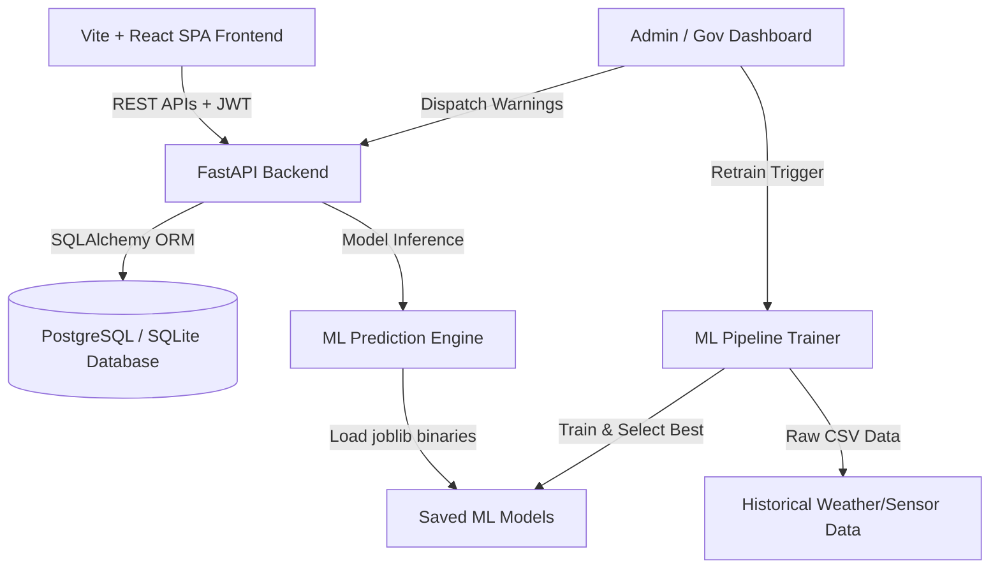
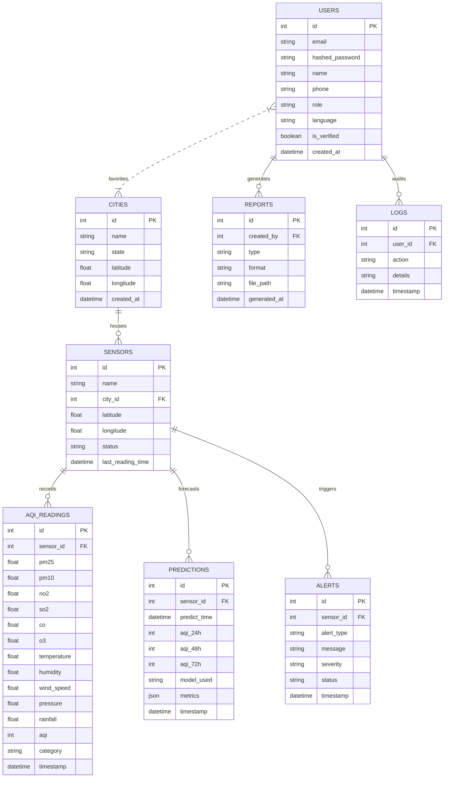

# AirGuard AI – Air Quality Prediction & Smart Health Advisory System

AirGuard AI is a production-ready, full-stack application designed to predict the Air Quality Index (AQI) using Machine Learning, visualize pollution trends, identify pollution hotspots, and provide personalized health advisories for citizens and government authorities. Built for the Smart India Hackathon (SIH), it implements a modern, glassmorphic design and modular backend service architecture.

---

## 🚀 Key Features

- **Multi-Model ML Pipeline**: Automatically trains and evaluates five models: Linear Regression, Decision Trees, Random Forests, XGBoost, and MLP Neural Networks. It selects the best-performing configuration based on RMSE and $R^2$.
- **72-Hour Predictions**: Forecasts hourly AQI values for 24-hour, 48-hour, and 72-hour intervals.
- **Explainable AI (XAI)**: Identifies which pollutants (PM2.5, PM10, ozone, weather, etc.) are contributing most to the predictions.
- **Smart Cohort Advisories**: Displays customized health instructions for vulnerable groups (children, elderly, pregnant women, asthmatics, heart patients, and athletes).
- **Green Commute Routing**: Calculates navigation routes that bypass heavy pollution zones based on real-time spatial readings.
- **Personal Carbon Footprint**: Audits commuter carbon footprints and recommends eco-friendly transportation modes.
- **Government Control Deck**: Enables authorities to dispatch real-time emergency broadcasts (GRAP enforcement) and generate analytics reports.
- **Multi-language Support**: Fully supports English, Hindi, and Marathi.
- **Simulated Voice Assistant**: Voice navigation support using browser Speech Recognition and Speech Synthesis.

---

## 🏗️ System Architecture



---

## 🧬 Entity-Relationship (ER) Diagram



---

## 🛠️ Technology Stack

- **Frontend**: React.js 18 + TypeScript + Vite + Tailwind CSS + Framer Motion
- **Maps**: React-Leaflet
- **Charts**: Recharts
- **Backend**: Python FastAPI (Uvicorn server)
- **Database**: SQLAlchemy + SQLite (local development) / PostgreSQL (production)
- **Machine Learning**: Scikit-Learn + XGBoost + Joblib + Pandas + NumPy
- **Authentication**: PyJWT + Passlib (bcrypt)
- **Deployment**: Docker Compose

---

## 🏁 Installation & Startup

### Prerequisites
- **Node.js** (v18 or above)
- **Python** (v3.10 or above)

### Option 1: Running Locally (Recommended for Development)

1. **Start the Backend server**:
   ```bash
   cd backend
   # Install dependencies
   pip install -r requirements.txt
   
   # Run the ML pipeline training to generate models
   python ml_pipeline/train.py
   
   # Start the FastAPI application
   python run.py
   ```
   *The database is dynamically initialized on startup and seeded with 7 days of hourly historical readings for Delhi, Mumbai, and Pune.*

2. **Start the Frontend client**:
   ```bash
   cd ../frontend
   # Install dependencies
   npm install
   
   # Start the Vite development server
   npm run dev
   ```
   Open your browser and navigate to `http://localhost:5173`.

### Option 2: Running with Docker Compose
To launch both components as orchestrating services:
```bash
docker-compose up --build
```
Access the application at `http://localhost:5173`. The backend swagger docs can be viewed at `http://localhost:8000/docs`.

---

## 📑 Core REST API Catalog

| Endpoint | Method | Role | Description |
| :--- | :--- | :--- | :--- |
| `/api/v1/auth/register` | POST | Public | Register new citizen or officer. |
| `/api/v1/auth/login` | POST | Public | Authenticate and retrieve JWT access token. |
| `/api/v1/auth/me` | GET | Authenticated | Retrieve current user profile. |
| `/api/v1/citizen/dashboard` | GET | Citizen | Retrieve current AQI, weather, 72h forecast, and health advisories. |
| `/api/v1/citizen/favorites` | GET/POST | Citizen | Manage favorite tracking locations. |
| `/api/v1/government/dashboard` | GET | Government | Retrieve district heatmaps and model retraining comparison benchmarks. |
| `/api/v1/government/alerts` | POST | Government | Broadcast real-time emergency alerts. |
| `/api/v1/government/reports` | POST/GET | Government | Request CSV/PDF compliance report generation. |
| `/api/v1/admin/users` | GET/PUT/DEL | Admin | Manage user records and adjust permission roles. |
| `/api/v1/admin/sensors` | POST/PUT/DEL | Admin | Deploy IOT sensors and toggle active states. |
| `/api/v1/ml/retrain` | POST | Admin | Trigger background ML model retraining. |
| `/api/v1/chatbot` | POST | Authenticated | Query the multi-language AI assistant. |
| `/api/v1/green-route` | POST | Authenticated | Compute clean air route recommendations. |
| `/api/v1/carbon-calculator`| POST | Authenticated | Compute commuter carbon footprints. |

---

## 🧪 Verification & Testing

To execute automated integration tests covering JWT authentication, ML predictions, green routing, and chatbot outputs:
```bash
cd backend
pip install pytest
pytest test_main.py -v
```
All unit tests should complete successfully with an active network connection.
